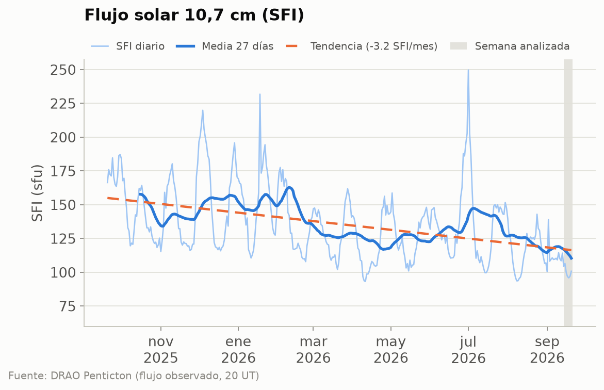
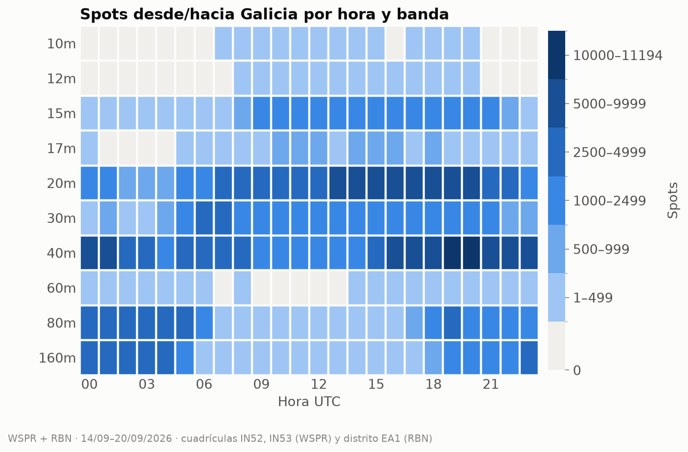
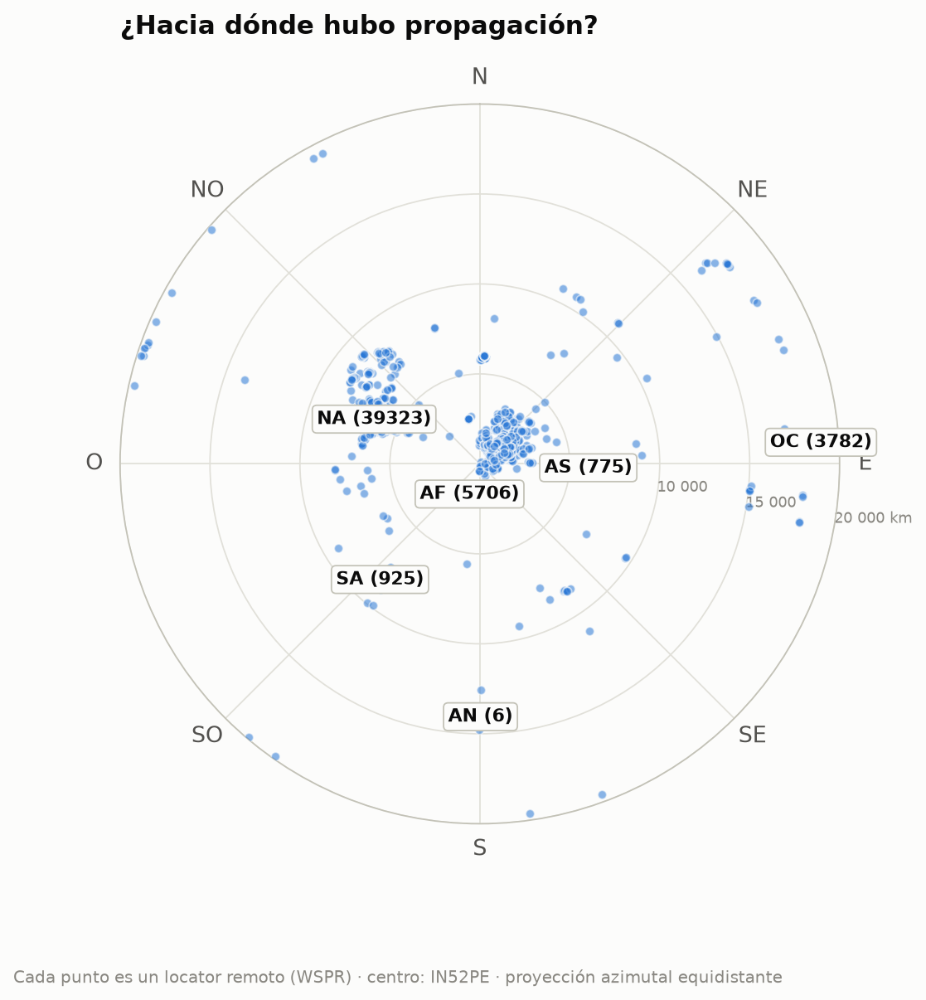

# Propagación HF/VHF desde Vigo · semana 2026-W39

**EA1RKV · Unión de Radioaficionados de Vigo-Val Miñor** · estación de referencia
Vigo (IN52PE) · semana analizada: 14 de septiembre de 2026 – 20 de septiembre de 2026 ·
previsión: lun 21/9 – dom 27/9

> Este informe combina **lo que dice la teoría** (índices solares, predicciones) con **lo que pasó
> de verdad** (spots reales desde Galicia). Todas las horas en UTC salvo que se indique lo contrario.

## 1. El Sol y el campo geomagnético

- **Flujo solar (SFI):** media **100**, máximo 107, mínimo 96 ·
  tendencia frente a la semana anterior: **a la baja (-10 %)** (media previa 111).
- **SSN efectivo aproximado:** ≈ **41** (SSN ≈ 1,14·SFI − 73,2) · número de manchas observado (media): 25.
- **Campo geomagnético:** 🟡 **inquieto** · Kp máximo **4,00** · Ap medio **8** (máx. 11) · 1 día(s) con Kp ≥ 4.
- **Fulguraciones:** ninguna de clase M o X. Sin apagones de radio por fulguraciones.

| Día | SFI | Manchas | Ap | Kp máx. | |
|---|---:|---:|---:|---:|:-:|
| lun 14/9 | 104 | 51 | 11 | 4,00 | 🟡 |
| mar 15/9 | 107 | 23 | 8 | 3,33 | 🟢 |
| mié 16/9 | 100 | 23 | 9 | 3,67 | 🟢 |
| jue 17/9 | 97 | 11 | 9 | 3,00 | 🟢 |
| vie 18/9 | 96 | 0 | 5 | 2,00 | 🟢 |
| sáb 19/9 | 97 | 11 | 7 | 2,67 | 🟢 |
| dom 20/9 | 101 | 54 | 6 | 3,00 | 🟢 |

_Semáforo Kp: 🟢 ≤ 3 tranquilo · 🟡 4 inquieto · 🔴 ≥ 5 tormenta._

_Estamos en la fase descendente del ciclo 25: el SFI baja poco a poco, con altibajos de ~27 días
(la rotación del Sol). La línea discontinua marca la tendencia del último año._

**Lo que espera NOAA para esta semana:** SFI entre 100 y 105, Ap máximo
20 y Kp máximo 5 (🔴 tormenta geomagnética (G1));
días con Kp ≥ 4 previstos: jue 24/9, vie 25/9.

## 2. Lo que pasó de verdad desde Galicia

Esta semana se registraron **348 500 spots** con una estación gallega en un extremo (297 637 de WSPR, de 6 estaciones en IN52/IN53, y 50 863 de la Reverse Beacon Network en CW/RTTY).
Las bandas con más actividad fueron **40m** (118 899), **20m** (101 070), **30m** (33 354), **80m** (33 021), y la hora más movida, las **19 UTC**.

_Cómo leerlo: cada casilla es una hora UTC en una banda; cuanto más oscura, más spots. Fíjate en
cómo las bandas altas (10–15 m) se «encienden» con el Sol y las bajas (40–80 m) de noche._

### DX de la semana por banda

| Banda | Distancia | Estación gallega | Corresponsal | Locator | Continente | Cuándo | SNR |
|---|---:|---|---|---|---|---|---:|
| 160m | 9 257 km | EA1DAV | Y84GI (oído desde Galicia) | JF40 | África | vie 18/9 20:00 UTC | -33 dB |
| 80m | 17 045 km | EB1A | VK5ARG (oyó a Galicia) | PF95ht | Oceanía | vie 18/9 18:00 UTC | -30 dB |
| 40m | 19 820 km | EB1A | ZL2005SWL (oyó a Galicia) | RE68mx | Oceanía | vie 18/9 06:48 UTC | -23 dB |
| 30m | 19 820 km | EB1A | ZL2005SWL (oyó a Galicia) | RE68mx | Oceanía | mié 16/9 05:12 UTC | -25 dB |
| 20m | 19 869 km | EB1A | ZL3RCK (oyó a Galicia) | RE66ft | Oceanía | mié 16/9 06:56 UTC | -14 dB |
| 17m | 17 719 km | EB1A | VK3FSK (oyó a Galicia) | QF22kg | Oceanía | lun 14/9 07:50 UTC | -22 dB |
| 15m | 17 667 km | EB1A | VK4EMM (oyó a Galicia) | QG62lr | Oceanía | lun 14/9 15:42 UTC | -25 dB |

_Distancias de círculo máximo medidas desde IN52PE (WSPR)._

### Rutas por continente

| Continente | Spots | 160m | 80m | 60m | 40m | 30m | 20m | 17m | 15m | 12m | 10m | 
|---|---:|---:|---:|---:|---:|---:|---:|---:|---:|---:|---:|
| Europa | **290 590** | 29783 | 30827 | 136 | 107578 | 29720 | 74859 | 4780 | 12780 | 31 | 96 | 
| Norteamérica | **45 021** | 353 | 1714 | 2 | 7951 | 2048 | 21932 | 1826 | 9187 | 6 | 2 | 
| África | **5 911** | 563 | 453 | · | 1481 | 737 | 1520 | 213 | 943 | · | 1 | 
| Oceanía | **3 995** | · | 8 | · | 1306 | 544 | 1877 | 49 | 211 | · | · | 
| Asia | **1 695** | 177 | 2 | · | 364 | 111 | 595 | 63 | 349 | 6 | 28 | 
| Sudamérica | **1 282** | · | 17 | · | 213 | 194 | 287 | 115 | 411 | 11 | 34 | 
| Antártida | **6** | · | · | · | 6 | · | · | · | · | · | · | 

_Mapa centrado en Vigo: el ángulo es el rumbo al que apuntaría tu antena y la distancia al centro,
los kilómetros. Entre paréntesis, los spots de cada continente. 1 479 locators distintos._

## 3. Previsión para la semana (lun 21/9 – dom 27/9)

### DX: fiabilidad prevista (VOACAP)

_Sin datos esta semana._

### NVIS y contactos regionales (80 y 40 m)

_Sin datos esta semana._

### Línea gris

El jue 24/9, en Vigo amanece a las **06:24 UTC** y anochece a las **18:28 UTC**.
Durante el crepúsculo la absorción de la capa D desaparece antes de que se deshaga la capa F: es
el momento de buscar DX en 160, 80 y 40 m a lo largo del terminador.

| Destino | Orto DX | Ocaso DX | Terminador común (±45 min) | Noche en los dos extremos |
|---|---|---|---|---|
| Norteamérica este (Nueva York) | 10:45 | 22:49 | — | 22:51–06:24 |
| Caribe (Santo Domingo) | 10:29 | 22:34 | — | 22:34–06:24 |
| Sudamérica (Buenos Aires) | 09:40 | 21:51 | — | 21:50–06:24 |
| Japón (Tokio) | 20:30 | 08:35 | — | 18:28–20:31 |
| Oceanía (Sídney) | 19:42 | 07:52 | 18:56–19:13 UTC (ocaso Vigo / orto DX) | 18:28–19:41 |
| Sudáfrica (Johannesburgo) | 03:55 | 16:04 | — | 18:30–03:55 |

_El «terminador común» es la línea gris propiamente dicha (amanecer o anochecer a la vez en los dos
extremos). La «noche en los dos extremos» es la ventana para 160 y 80 m, y a menudo para 40 m._

## 4. Agenda y efemérides

### Concursos del fin de semana

_Sin datos esta semana._

### Lluvias de meteoros (meteor scatter en 6 m y 2 m)

- **Dracónidas** — máximo jue 8/10 (dentro de 17 días), THZ ≈ 10 · variable, a veces estallidos.
- **Oriónidas** — máximo mié 21/10 (dentro de 30 días), THZ ≈ 20.

_Consejo: el meteor scatter funciona mejor al amanecer local, cuando la Tierra «barre» los
meteoros de frente. Modos: MSK144 (6 m/2 m) con WSJT-X._

### Pases de satélites desde Vigo

Los mejores pases (elevación máxima ≥ 30°) de cada satélite:

| Satélite | Día | AOS (UTC) | LOS (UTC) | Hora local | Elev. máx. | Min |
|---|---|---|---|---|---:|---:|
| RS-44 | lun 21/9 | 06:23 | 06:46 | 08:23 | 85° | 23 |
| AO-123 | lun 21/9 | 08:54 | 09:05 | 10:54 | 81° | 11 |
| AO-7 | lun 21/9 | 18:23 | 18:45 | 20:23 | 80° | 22 |
| RS-44 | lun 21/9 | 19:01 | 19:24 | 21:01 | 81° | 23 |
| FO-29 | lun 21/9 | 19:36 | 19:53 | 21:36 | 89° | 17 |
| ISS (ZARYA) | lun 21/9 | 21:37 | 21:47 | 23:37 | 78° | 11 |
| AO-27 | lun 21/9 | 21:59 | 22:15 | 23:59 | 88° | 15 |
| FO-29 | mié 23/9 | 06:35 | 06:56 | 08:35 | 86° | 21 |
| SO-50 | mié 23/9 | 14:30 | 14:45 | 16:30 | 69° | 14 |
| AO-7 | mié 23/9 | 18:16 | 18:38 | 20:16 | 87° | 22 |
| SO-50 | mié 23/9 | 22:59 | 23:13 | 00:59 | 72° | 14 |
| AO-123 | jue 24/9 | 08:46 | 08:57 | 10:46 | 80° | 11 |
| ISS (ZARYA) | jue 24/9 | 14:23 | 14:34 | 16:23 | 79° | 11 |
| AO-123 | jue 24/9 | 21:41 | 21:52 | 23:41 | 85° | 11 |
| AO-27 | jue 24/9 | 22:09 | 22:24 | 00:09 | 77° | 15 |
| FO-29 | vie 25/9 | 06:30 | 06:50 | 08:30 | 90° | 21 |
| AO-7 | vie 25/9 | 18:08 | 18:31 | 20:08 | 86° | 22 |
| RS-44 | vie 25/9 | 18:43 | 19:06 | 20:43 | 89° | 23 |
| ISS (ZARYA) | vie 25/9 | 20:05 | 20:16 | 22:05 | 75° | 11 |
| SO-50 | sáb 26/9 | 22:11 | 22:25 | 00:11 | 71° | 14 |
| AO-27 | dom 27/9 | 11:00 | 11:15 | 13:00 | 83° | 15 |

## 5. Comentario del club

<!-- COMENTARIO -->
> PENDIENTE: un socio debe escribir aquí su comentario (qué trabajó, qué oyó, qué recomienda
> para la semana). **El informe no se publica sin este párrafo.**
<!-- /COMENTARIO -->

---

### Fuentes

- NOAA SWPC — daily solar/geomagnetic indices, GOES X-ray flares, 27-day outlook (https://www.swpc.noaa.gov/)
- NRC Canada / DRAO Penticton — histórico diario del flujo F10.7 (https://www.spaceweather.gc.ca/)
- WSPRnet vía wspr.live (https://wspr.live/)
- Reverse Beacon Network (https://www.reversebeacon.net/)
- International Meteor Organization — calendario de lluvias (https://www.imo.net/)
- CelesTrak — TLE de satélites de radioaficionado (https://celestrak.org/)
- Cálculos propios: SSN efectivo, distancias de círculo máximo, MUF por ley de la secante y
  orto/ocaso (algoritmo de NOAA).

Borrador generado automáticamente el 2026-09-27 21:25 UTC por el script del radioclub
EA1RKV. Las secciones sin datos indican que la fuente no respondió esta semana.
