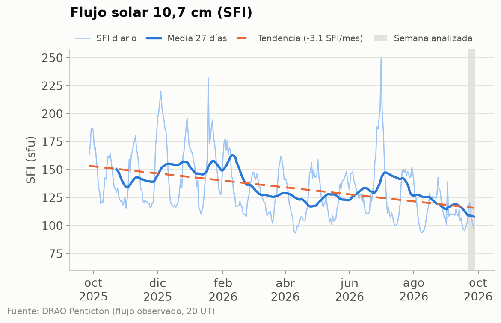
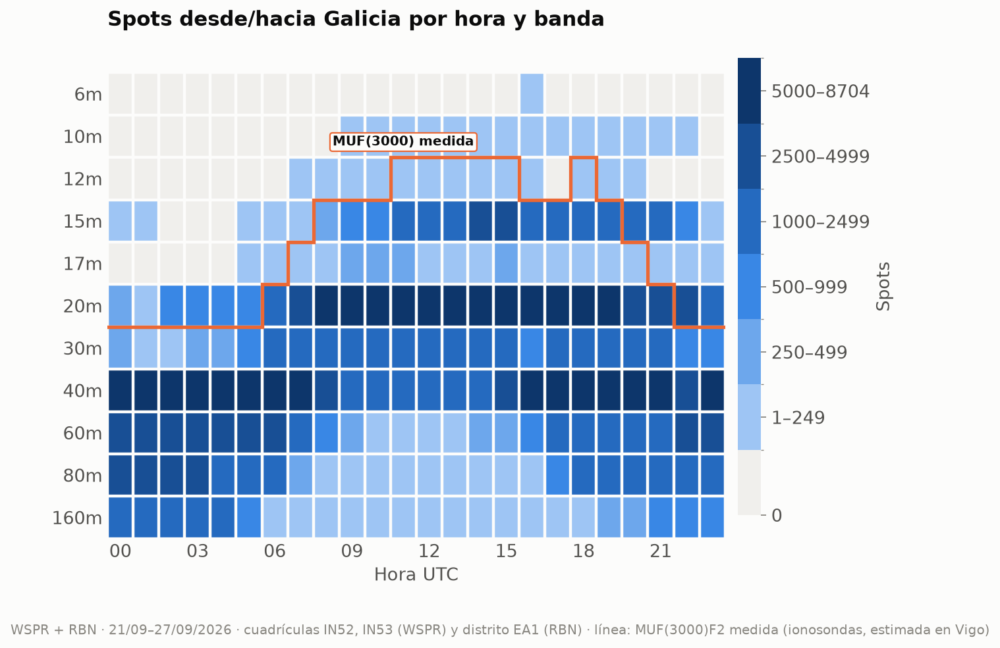
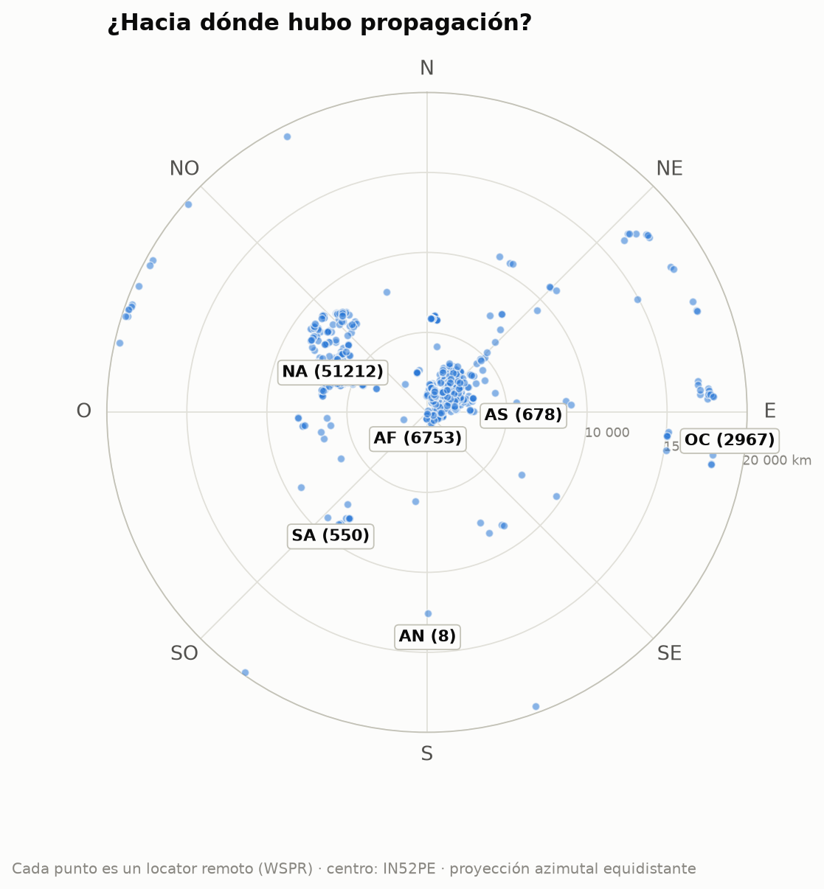
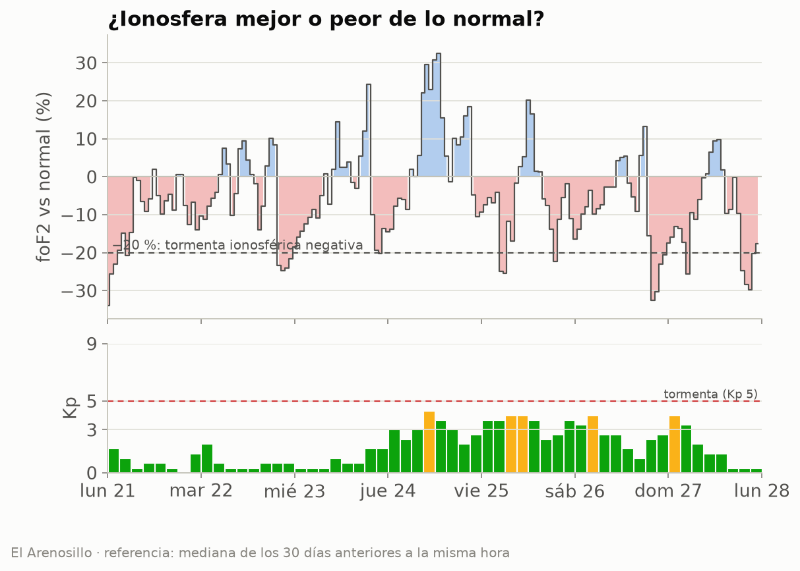
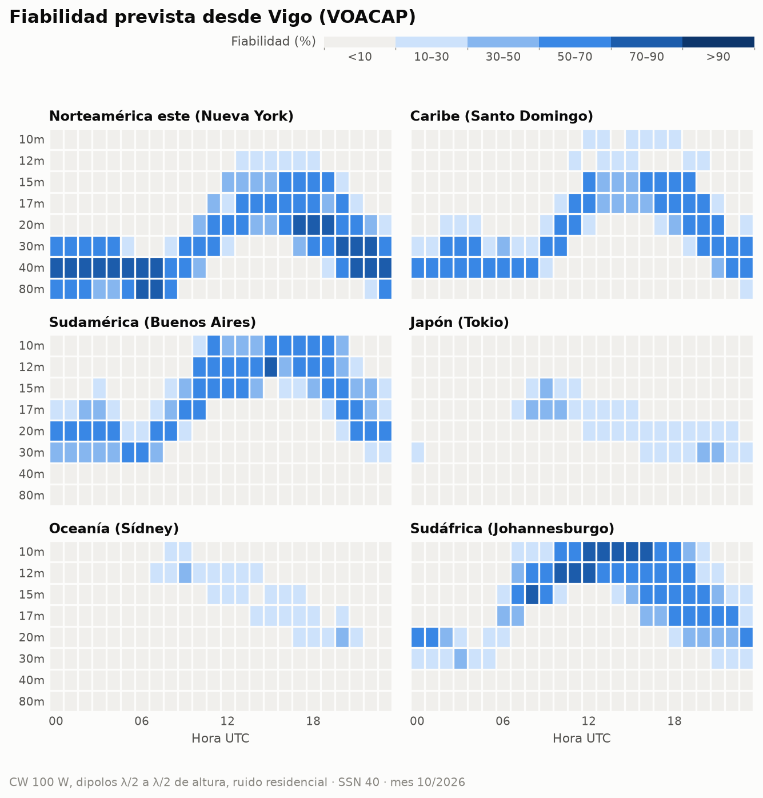
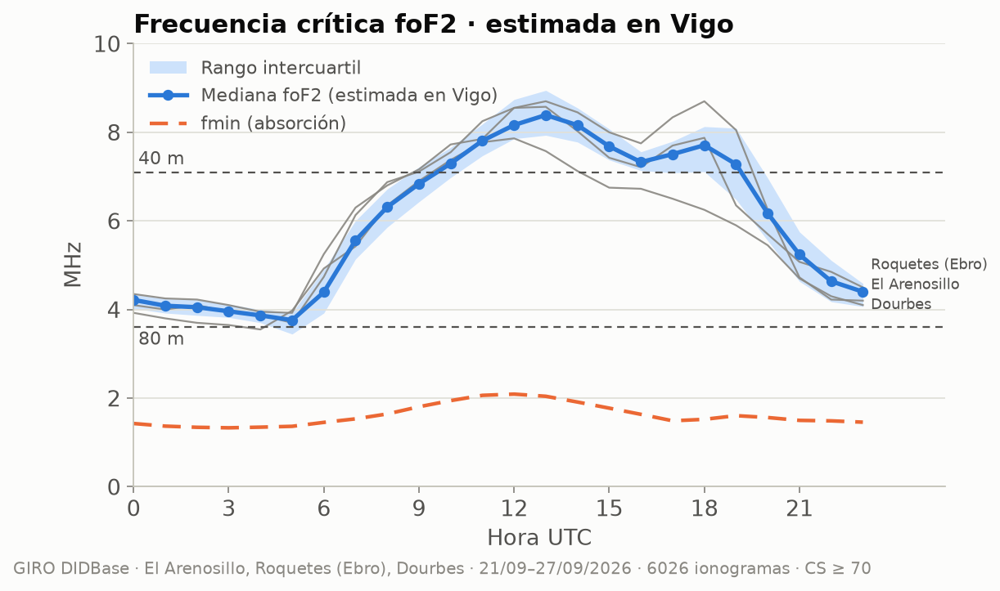

# Propagación HF/VHF desde Vigo · semana 2026-W40

**EA1RKV · Unión de Radioaficionados de Vigo-Val Miñor** · estación de referencia
Vigo (IN52PE) · semana analizada: 21 de septiembre de 2026 – 27 de septiembre de 2026 ·
previsión: lun 28/9 – dom 4/10

> Este informe combina **lo que dice la teoría** (índices solares, predicciones) con **lo que pasó
> de verdad** (spots reales desde Galicia). Todas las horas en UTC salvo que se indique lo contrario.

## 1. El Sol y el campo geomagnético

- **Flujo solar (SFI):** media **108**, máximo 121, mínimo 97 ·
  tendencia frente a la semana anterior: **al alza (+8 %)** (media previa 100).
- **SSN efectivo aproximado:** ≈ **50** (SSN ≈ 1,14·SFI − 73,2) · número de manchas observado (media): 106.
- **Campo geomagnético:** 🟡 **inquieto** · Kp máximo **4,33** · Ap medio **10** (máx. 20) · 4 día(s) con Kp ≥ 4.
- **Fulguraciones:** ninguna de clase M o X. Sin apagones de radio por fulguraciones.

| Día | SFI | Manchas | Ap | Kp máx. | |
|---|---:|---:|---:|---:|:-:|
| lun 21/9 | 104 | 85 | 3 | 1,67 | 🟢 |
| mar 22/9 | 118 | 126 | 3 | 2,00 | 🟢 |
| mié 23/9 | 121 | 142 | 4 | 1,67 | 🟢 |
| jue 24/9 | 112 | 124 | 16 | 4,33 | 🟡 |
| vie 25/9 | 105 | 110 | 20 | 4,00 | 🟡 |
| sáb 26/9 | 101 | 88 | 13 | 4,00 | 🟡 |
| dom 27/9 | 97 | 67 | 9 | 4,00 | 🟡 |

_Semáforo Kp: 🟢 ≤ 3 tranquilo · 🟡 4 inquieto · 🔴 ≥ 5 tormenta._

_Estamos en la fase descendente del ciclo 25: el SFI baja poco a poco, con altibajos de ~27 días
(la rotación del Sol). La línea discontinua marca la tendencia del último año._

**Lo que espera NOAA para esta semana:** SFI entre 90 y 105, Ap máximo
12 y Kp máximo 4 (🟡 inquieto);
días con Kp ≥ 4 previstos: dom 4/10.

## 2. Lo que pasó de verdad desde Galicia

Esta semana se registraron **359 939 spots** con una estación gallega en un extremo (297 600 de WSPR, de 5 estaciones en IN52/IN53, y 62 339 de la Reverse Beacon Network en CW/RTTY).
Las bandas con más actividad fueron **40m** (114 120), **20m** (103 891), **60m** (41 078), **80m** (31 947), y la hora más movida, las **18 UTC**.

_Cómo leerlo: cada casilla es una hora UTC en una banda; cuanto más oscura, más spots. Fíjate en
cómo las bandas altas (10–15 m) se «encienden» con el Sol y las bajas (40–80 m) de noche.__La línea naranja es la **MUF(3000)F2 medida** por las ionosondas: por debajo de ella, la teoría dice
que la banda abre para un salto de 3 000 km. Si los spots siguen la línea, teoría y realidad coinciden._
### DX de la semana por banda

| Banda | Distancia | Estación gallega | Corresponsal | Locator | Continente | Cuándo | SNR |
|---|---:|---|---|---|---|---|---:|
| 160m | 5 627 km | EB1A | KK4FL (oyó a Galicia) | FM17tv | Norteamérica | lun 21/9 05:24 UTC | -23 dB |
| 80m | 19 820 km | EB1A | ZL2005SWL (oyó a Galicia) | RE68mx | Oceanía | jue 24/9 06:24 UTC | -24 dB |
| 60m | 19 820 km | EB1A | ZL2005SWL (oyó a Galicia) | RE68mx | Oceanía | jue 24/9 06:18 UTC | -24 dB |
| 40m | 19 820 km | EB1A | ZL2005SWL (oyó a Galicia) | RE68mx | Oceanía | mié 23/9 06:54 UTC | -19 dB |
| 30m | 19 820 km | EB1A | ZL2005SWL (oyó a Galicia) | RE68mx | Oceanía | mar 22/9 18:32 UTC | -27 dB |
| 20m | 19 828 km | EB1A | ZL3TKI (oyó a Galicia) | RE66hk | Oceanía | mar 22/9 18:52 UTC | -22 dB |
| 17m | 17 745 km | QA6OKW | VK5WA/2 (oyó a Galicia) | QG50nf | Oceanía | lun 21/9 10:12 UTC | -26 dB |
| 15m | 18 000 km | EB1A | VK7FLYN (oyó a Galicia) | QE38lr | Oceanía | jue 24/9 12:50 UTC | -21 dB |

_Distancias de círculo máximo medidas desde IN52PE (WSPR)._

### Rutas por continente

| Continente | Spots | 160m | 80m | 60m | 40m | 30m | 20m | 17m | 15m | 12m | 10m | 6m | 
|---|---:|---:|---:|---:|---:|---:|---:|---:|---:|---:|---:|---:|
| Europa | **285 223** | 10777 | 28539 | 32847 | 97961 | 26788 | 76342 | 1990 | 9893 | 28 | 49 | 9 | 
| Norteamérica | **61 464** | 230 | 2697 | 7073 | 12784 | 1553 | 23193 | 729 | 13172 | 11 | 22 | · | 
| África | **7 038** | 423 | 650 | 1072 | 1699 | 603 | 1603 | 111 | 861 | · | 16 | · | 
| Oceanía | **3 295** | · | 16 | 86 | 1021 | 427 | 1613 | 9 | 123 | · | · | · | 
| Asia | **2 014** | · | 26 | · | 444 | 158 | 903 | 68 | 386 | 14 | 15 | · | 
| Sudamérica | **897** | · | 19 | · | 207 | 18 | 237 | 14 | 370 | 6 | 26 | · | 
| Antártida | **8** | · | · | · | 4 | 4 | · | · | · | · | · | · | 

_Mapa centrado en Vigo: el ángulo es el rumbo al que apuntaría tu antena y la distancia al centro,
los kilómetros. Entre paréntesis, los spots de cada continente. 1 520 locators distintos._

### La ionosfera medida

Datos de las digisondas de **El Arenosillo** (37,1° N), **Roquetes (Ebro)** (40,8° N), **Dourbes** (50,1° N).
Solo usamos ionogramas con confianza de autoescalado ≥ 70 % y descartamos los valores
que se salen de lo que marcan sus vecinos (los errores típicos del escalado automático).

#### ¿Mejor o peor de lo normal?

La foF2 se movió en torno a lo habitual (media semanal -6 %; el peor día, el
dom 27/9, con -11 %). Sin tormentas ionosféricas negativas.

_Se compara cada medida de El Arenosillo con la mediana de los 30 días anteriores a la misma hora.
Por debajo del −20 % hablamos de tormenta ionosférica negativa._

#### ¿Hubo esporádica E esta semana?

**Algo:** la foEs pasó de 5,6 MHz, lo bastante para aperturas cortas en 10 m, pero no llegó a 6 m.

| Ionosonda | Día | Desde | Hasta (UTC) | foEs máx. | MUF Es (~1 800 km) | Banda | Spots WSPR |
|---|---|---|---|---:|---:|---|---:|
| Roquetes (Ebro) | mié 23/9 | 16:00 | 16:15 | 5,9 MHz | 30 MHz | 10m | 0 |

_La MUF de la Es para un salto de 1 500–2 000 km es unas 5 veces la foEs. «Spots WSPR»: spots de esa
banda a 800–2 500 km desde Galicia durante el episodio._

#### Teoría frente a realidad

Comparamos, hora a hora, lo que dice la MUF(3000) medida con lo que se oyó de verdad a 2 000–4 000 km
(un salto de F2) en 20m, 17m, 15m. **Coinciden en el 76 %** de las
72 casillas hora × banda. En 9 la MUF decía «abierta» pero
no hubo spots (poca actividad WSPR en esa banda y hora, o absorción). En 8
hubo spots aunque la MUF típica no llegaba, sobre todo en 20m y 17m: días mejores
que la mediana o esporádica E. La línea naranja del mapa de calor muestra lo mismo de un vistazo.

#### Notas curiosas (El Arenosillo)

- La capa F2 tuvo su pico a **246 km** de altura a mediodía y a 335 km de noche.
- La capa F1 apareció de día, con foF1 de hasta 5,4 MHz (10:30 UTC).
- **Spread-F:** se vio en 4 noche(s) (5 h en total). Son irregularidades de la capa F que en la radio se notan como *flutter* y ecos, sobre todo en 40–80 m de madrugada.

## 3. Previsión para la semana (lun 28/9 – dom 4/10)

### DX: fiabilidad prevista (VOACAP)

Bandas con fiabilidad media ≥ 50 % por franja horaria (UTC), la mejor primero. En cursiva, la
mejor banda cuando ninguna llega al 50 % (apertura posible pero poco fiable):

| Destino | km | Rumbo | 00–04 | 04–08 | 08–12 | 12–16 | 16–20 | 20–24 | 
|---|---:|---:|---|---|---|---|---|---|
| Norteamérica este (Nueva York) | 5 307 | 291° | 40m, 30m, 80m | 40m, 80m | _30m (47 %)_ | _20m (50 %)_ | 20m, 17m, 15m | 40m, 30m | 
| Caribe (Santo Domingo) | 6 288 | 265° | 40m | 40m | _20m (34 %)_ | _15m (42 %)_ | 17m, 15m | 30m | 
| Sudamérica (Buenos Aires) | 9 922 | 219° | 20m | _30m (45 %)_ | _15m (48 %)_ | 12m | 10m, 12m | _20m (46 %)_ | 
| Japón (Tokio) | 10 780 | 25° | — | — | _17m (39 %)_ | — | _20m (23 %)_ | _30m (31 %)_ | 
| Oceanía (Sídney) | 18 035 | 69° | — | — | _12m (22 %)_ | — | — | — | 
| Sudáfrica (Johannesburgo) | 8 489 | 146° | _20m (44 %)_ | — | 12m | 10m, 12m | 12m, 15m, 10m | _17m (47 %)_ | 

_Supuestos: CW a 100 W, dipolos de media onda a media longitud de onda de altura en los dos
extremos, ruido residencial. SSN usado: **40** (SSN efectivo del SFI previsto (99)). En SSB hacen
falta ~17 dB más de señal, así que resta fiabilidad; en FT8, suma. VOACAP describe el promedio
mensual: un día concreto puede ir mucho mejor o peor._

### NVIS y contactos regionales (80 y 40 m)

Combinando El Arenosillo, Roquetes (Ebro), Dourbes y llevándolas a la latitud y la hora local de Vigo
(El Arenosillo sola, 5° más al sur, resulta algo optimista), la **foF2 mediana estimada en Vigo fue de
6,2 MHz** la
semana pasada: de 3,8 MHz de madrugada a 8,4 MHz hacia las
13 UTC. El pico de la
capa F2 estuvo de mediana a 263 km.

| Trayecto | sec φ | 80 m abierta | 40 m abierta | MUF (mín.–máx.) |
|---|---:|---|---|---|
| NVIS (Galicia, < 200 km) | 1,00 | 06–03 UTC | 12–15 UTC | 3,8–8,4 MHz |
| Vigo – Madrid (~460 km) | 1,32 | todo el día | 08–21 UTC | 4,7–11,4 MHz |
| Vigo – Barcelona (~900 km) | 1,90 | 16–09 UTC · _absorción: 09–16 UTC_ | 06–23 UTC | 6,5–16,6 MHz |

**A 3 000 km** (un salto de F2, p. ej. Canarias–Escandinavia): la **MUF(3000)F2 medida** fue de
11,5 a 27,7 MHz (máxima hacia las 13 UTC).
20m: 07–22 UTC · 17m: 08–21 UTC · 15m: 09–20 UTC · 12m: 13–14 UTC · 10m: cerrada.

> **¿Por qué importa foF2?** Es la frecuencia más alta que la capa F2 devuelve a tierra cuando
> la señal sube en vertical. En NVIS (*Near Vertical Incidence Skywave*, antenas bajas que radian
> hacia arriba) solo rebotan las frecuencias **por debajo de foF2**: si foF2 cae por debajo de
> 7,1 MHz, los 40 m «saltan» Galicia y hay que bajar a 80 m. Para trayectos más largos la señal
> llega inclinada y la capa aguanta más: la MUF de un salto es aproximadamente
> **foF2 · sec(φ)**, donde φ es el ángulo de incidencia en la ionosfera, calculado con la altura
> real del pico (hmF2) que mide la ionosonda. Para 3 000 km usamos directamente la MUF(3000)F2 que
> publica la digisonda, que ya tiene en cuenta la curvatura de la Tierra.
>
> **¿Y por abajo?** La capa D absorbe las frecuencias bajas de día. La **fmin** (frecuencia más
> baja del ionograma) sube a mediodía por esa absorción: la usamos para estimar la LUF
> (≈ fmin · √sec φ en la capa D). Una banda está «abierta» si la MUF la supera con un 10 % de
> margen y la LUF queda por debajo; «absorción» son las horas en que la MUF la deja pasar pero la
> capa D la cierra.

### Línea gris

El jue 1/10, en Vigo amanece a las **06:31 UTC** y anochece a las **18:16 UTC**.
Durante el crepúsculo la absorción de la capa D desaparece antes de que se deshaga la capa F: es
el momento de buscar DX en 160, 80 y 40 m a lo largo del terminador.

| Destino | Orto DX | Ocaso DX | Terminador común (±45 min) | Noche en los dos extremos |
|---|---|---|---|---|
| Norteamérica este (Nueva York) | 10:52 | 22:37 | — | 22:39–06:31 |
| Caribe (Santo Domingo) | 10:30 | 22:28 | — | 22:28–06:31 |
| Sudamérica (Buenos Aires) | 09:30 | 21:56 | — | 21:55–06:31 |
| Japón (Tokio) | 20:35 | 08:25 | — | 18:16–20:36 |
| Oceanía (Sídney) | 19:32 | 07:57 | 18:46–19:01 UTC (ocaso Vigo / orto DX) | 18:16–19:31 |
| Sudáfrica (Johannesburgo) | 03:47 | 16:07 | — | 18:18–03:47 |

_El «terminador común» es la línea gris propiamente dicha (amanecer o anochecer a la vez en los dos
extremos). La «noche en los dos extremos» es la ventana para 160 y 80 m, y a menudo para 40 m._

## 4. Agenda y efemérides

### Concursos del fin de semana

| Concurso | Empieza (UTC) | Termina (UTC) | Horas |
|---|---|---|---:|
| [URC DX RTTY Contest](https://www.contestcalendar.com/weeklycontdetails.php?ref=003fmoct) | vie 2/10 00:00 | sáb 3/10 00:00 | 24 |
| [K1USN Slow Speed Test](https://www.contestcalendar.com/weeklycontdetails.php?ref=003fsgmh) | vie 2/10 20:00 | vie 2/10 21:00 | 1 |
| [George Batterson 1936 QSO Party](https://www.contestcalendar.com/weeklycontdetails.php?ref=003gzrc2) | vie 2/10 23:00 | lun 5/10 03:00 | 52 |
| [TRC DX Contest](https://www.contestcalendar.com/weeklycontdetails.php?ref=003fltbc) | sáb 3/10 06:00 | dom 4/10 18:00 | 36 |
| [Oceania DX Contest, Phone](https://www.contestcalendar.com/weeklycontdetails.php?ref=003fkazy) | sáb 3/10 06:00 | dom 4/10 06:00 | 24 |
| [German Telegraphy Contest](https://www.contestcalendar.com/weeklycontdetails.php?ref=003fil9u) | sáb 3/10 07:00 | sáb 3/10 10:00 | 3 |
| [Russian WW Digital Contest](https://www.contestcalendar.com/weeklycontdetails.php?ref=003fl66y) | sáb 3/10 12:00 | dom 4/10 11:59 | 24 |
| [IARU Region 1 UHF/Microwaves Contest](https://www.contestcalendar.com/weeklycontdetails.php?ref=003fitdr) | sáb 3/10 14:00 | dom 4/10 14:00 | 24 |
| [California QSO Party](https://www.contestcalendar.com/weeklycontdetails.php?ref=003b0zd8) | sáb 3/10 16:00 | dom 4/10 22:00 | 30 |
| [International HELL-Contest](https://www.contestcalendar.com/weeklycontdetails.php?ref=003fj8f7) | sáb 3/10 16:00 | dom 4/10 11:00 | 19 |
| [50 MHz Fall Sprint](https://www.contestcalendar.com/weeklycontdetails.php?ref=003dp7wa) | sáb 3/10 18:00 | sáb 3/10 22:00 | 4 |
| [IARU Region 2 Area G HF SSB Contest](https://www.contestcalendar.com/weeklycontdetails.php?ref=003fj164) | sáb 3/10 22:00 | sáb 3/10 23:59 | 2 |
| [Collegiate QSO Party](https://www.contestcalendar.com/weeklycontdetails.php?ref=003fi5tm) | dom 4/10 00:00 | lun 5/10 23:59 | 48 |
| [UBA ON Contest, SSB](https://www.contestcalendar.com/weeklycontdetails.php?ref=003fm8g0) | dom 4/10 06:00 | dom 4/10 10:00 | 4 |
| [Peanut Power QRP Sprint](https://www.contestcalendar.com/weeklycontdetails.php?ref=003fkj1n) | dom 4/10 22:00 | dom 4/10 23:59 | 2 |

### Lluvias de meteoros (meteor scatter en 6 m y 2 m)

- **Dracónidas** — máximo jue 8/10 (dentro de 10 días), THZ ≈ 10 · variable, a veces estallidos.
- **Oriónidas** — máximo mié 21/10 (dentro de 23 días), THZ ≈ 20 · _activa esta semana_.

_Consejo: el meteor scatter funciona mejor al amanecer local, cuando la Tierra «barre» los
meteoros de frente. Modos: MSK144 (6 m/2 m) con WSJT-X._

### Pases de satélites desde Vigo

Los mejores pases (elevación máxima ≥ 30°) de cada satélite:

| Satélite | Día | AOS (UTC) | LOS (UTC) | Hora local | Elev. máx. | Min |
|---|---|---|---|---|---:|---:|
| RS-44 | lun 28/9 | 05:23 | 05:46 | 07:23 | 81° | 23 |
| ISS | lun 28/9 | 12:51 | 13:02 | 14:51 | 82° | 11 |
| FO-29 | mar 29/9 | 06:19 | 06:40 | 08:19 | 80° | 20 |
| AO-123 | mar 29/9 | 09:05 | 09:16 | 11:05 | 55° | 11 |
| SO-50 | mar 29/9 | 12:54 | 13:09 | 14:54 | 68° | 14 |
| RS-44 | mar 29/9 | 18:24 | 18:47 | 20:24 | 83° | 23 |
| ISS | mar 29/9 | 18:33 | 18:44 | 20:33 | 72° | 11 |
| SO-50 | mar 29/9 | 21:23 | 21:37 | 23:23 | 71° | 14 |
| AO-7 | mié 30/9 | 07:48 | 08:10 | 09:48 | 84° | 22 |
| AO-27 | mié 30/9 | 11:10 | 11:25 | 13:10 | 82° | 15 |
| FO-29 | jue 1/10 | 06:14 | 06:34 | 08:14 | 76° | 20 |
| AO-27 | jue 1/10 | 21:58 | 22:13 | 23:58 | 84° | 15 |
| RS-44 | vie 2/10 | 05:05 | 05:27 | 07:05 | 89° | 22 |
| AO-7 | vie 2/10 | 07:41 | 08:03 | 09:41 | 89° | 22 |
| AO-123 | vie 2/10 | 08:57 | 09:08 | 10:57 | 72° | 11 |
| ISS | vie 2/10 | 11:19 | 11:30 | 13:19 | 84° | 11 |
| SO-50 | vie 2/10 | 20:35 | 20:48 | 22:35 | 70° | 14 |
| AO-123 | vie 2/10 | 21:52 | 22:03 | 23:52 | 68° | 11 |
| FO-29 | sáb 3/10 | 06:09 | 06:29 | 08:09 | 71° | 20 |
| AO-7 | dom 4/10 | 07:33 | 07:56 | 09:33 | 82° | 22 |
| AO-27 | dom 4/10 | 22:08 | 22:23 | 00:08 | 80° | 15 |

## 5. Comentario del club

<!-- COMENTARIO -->
> PENDIENTE: un socio debe escribir aquí su comentario (qué trabajó, qué oyó, qué recomienda
> para la semana). **El informe no se publica sin este párrafo.**
<!-- /COMENTARIO -->

---

### Fuentes

- NOAA SWPC — daily solar/geomagnetic indices, GOES X-ray flares, 27-day outlook (https://www.swpc.noaa.gov/)
- NRC Canada / DRAO Penticton — histórico diario del flujo F10.7 (https://www.spaceweather.gc.ca/)
- WSPRnet vía wspr.live (https://wspr.live/)
- Reverse Beacon Network (https://www.reversebeacon.net/)
- GIRO / DIDBase, Lowell GIRO Data Center (https://giro.uml.edu/), datos CC-BY-NC-SA 4.0 de las digisondas de El Arenosillo (INTA), Roquetes (Observatori de l'Ebre), Dourbes (RMI Bélgica)
- VOACAP (voacapl, port para Linux de J. Watson; https://github.com/jawatson/voacapl)
- WA7BNM Contest Calendar (https://www.contestcalendar.com/)
- International Meteor Organization — calendario de lluvias (https://www.imo.net/)
- CelesTrak — TLE de satélites de radioaficionado (https://celestrak.org/)
- Cálculos propios: SSN efectivo, distancias de círculo máximo, MUF por ley de la secante y
  orto/ocaso (algoritmo de NOAA).

Borrador generado automáticamente el 2026-09-28 14:05 UTC por el script del radioclub
EA1RKV. Las secciones sin datos indican que la fuente no respondió esta semana.
