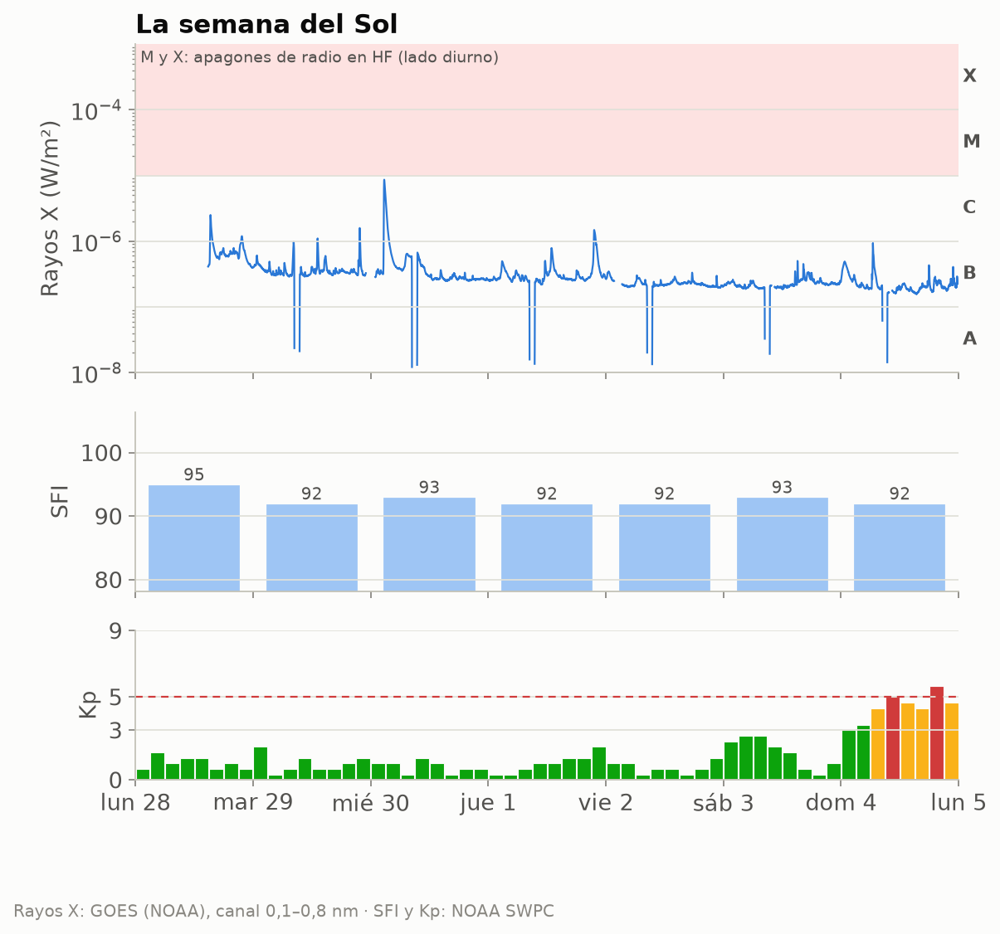
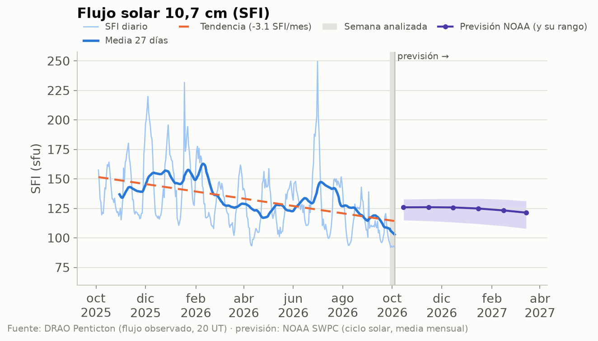
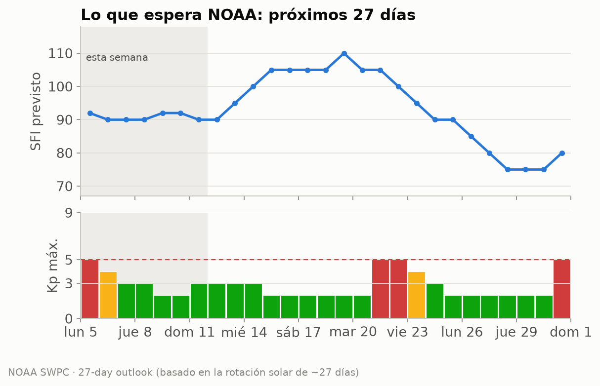
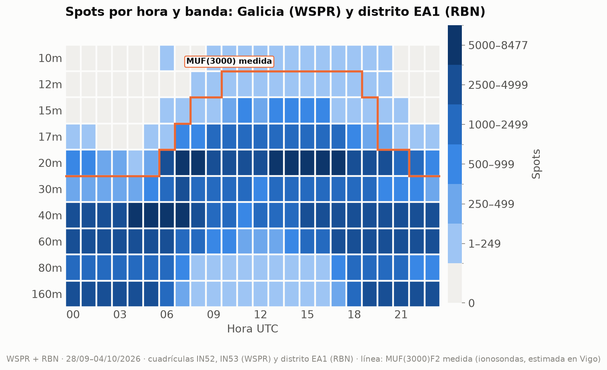
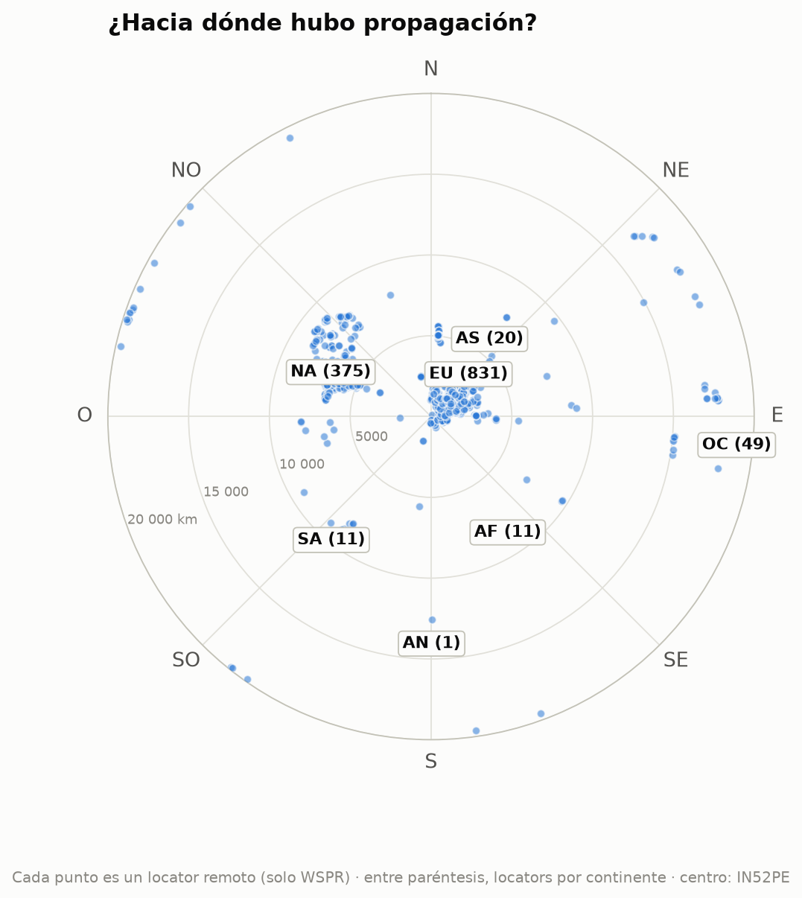
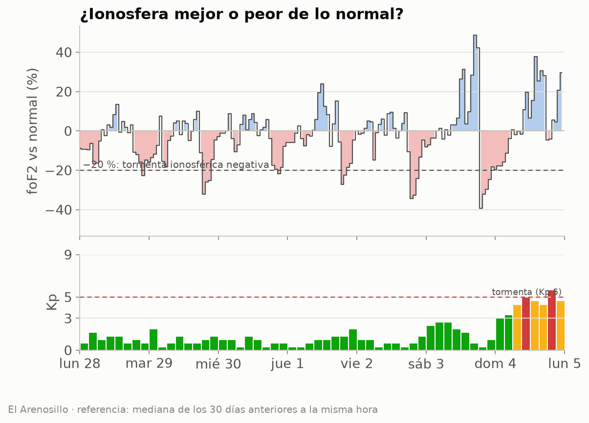
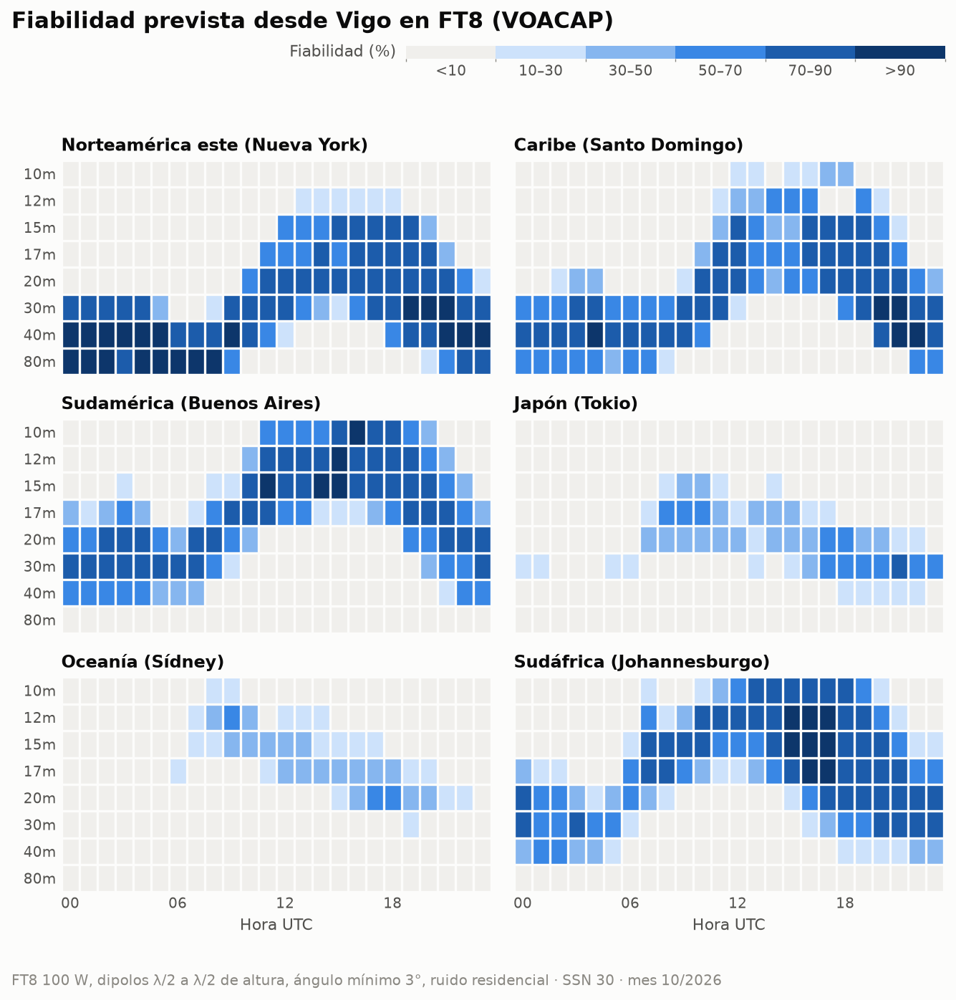
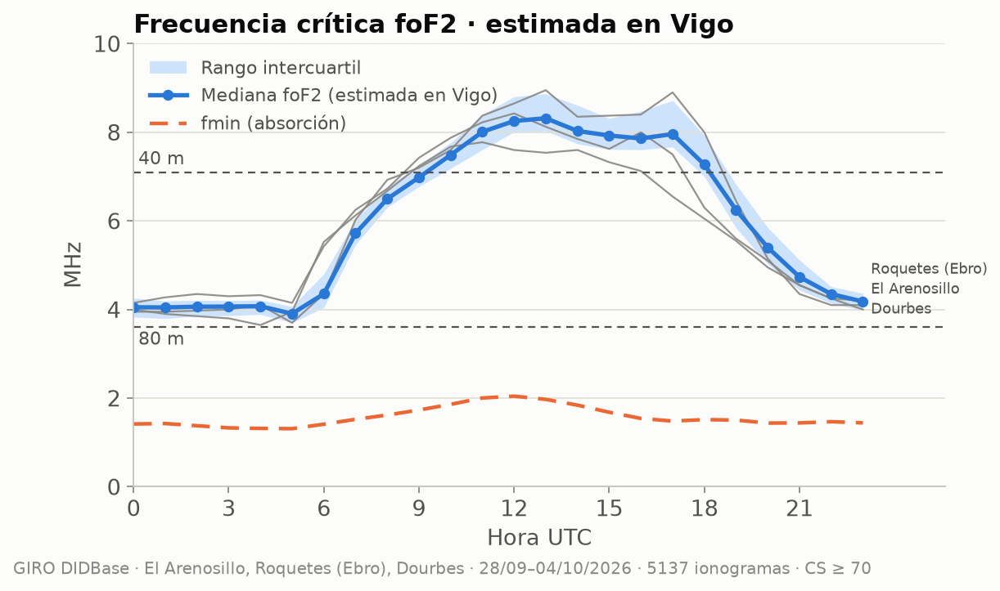

# Propagación HF/VHF desde Vigo · semana 2026-W41

**EA1RKV · Unión de Radioaficionados de Vigo-Val Miñor** · estación de referencia
Vigo (IN52PE) · semana analizada: 28 de septiembre de 2026 – 4 de octubre de 2026 ·
previsión: lun 5/10 – dom 11/10

> Este informe combina **lo que dice la teoría** (índices solares, predicciones) con **lo que pasó
> de verdad** (spots reales desde Galicia). Todas las horas en UTC salvo que se indique lo contrario.

## 1. El Sol y el campo geomagnético

- **Flujo solar (SFI):** media **93**, máximo 95, mínimo 92 ·
  tendencia frente a la semana anterior: **a la baja (-14 %)** (media previa 108).
- **SSN efectivo aproximado:** ≈ **32** (SSN ≈ 1,14·SFI − 73,2) · número de manchas observado (media): 41.
- **Campo geomagnético:** 🔴 **tormenta geomagnética (G1)** · Kp máximo **5,67** · Ap medio **9** (máx. 36) · 1 día(s) con Kp ≥ 4.
- **Fulguraciones:** ninguna de clase M o X. Sin apagones de radio por fulguraciones.

| Día | SFI | Manchas | Ap | Kp máx. | |
|---|---:|---:|---:|---:|:-:|
| lun 28/9 | 95 | 46 | 4 | 1,67 | 🟢 |
| mar 29/9 | 92 | 28 | 4 | 2,00 | 🟢 |
| mié 30/9 | 93 | 29 | 3 | 1,33 | 🟢 |
| jue 1/10 | 92 | 38 | 4 | 2,00 | 🟢 |
| vie 2/10 | 92 | 37 | 3 | 1,33 | 🟢 |
| sáb 3/10 | 93 | 53 | 7 | 2,67 | 🟢 |
| dom 4/10 | 92 | 55 | 36 | 5,67 | 🔴 |

_Semáforo Kp: 🟢 ≤ 3 tranquilo · 🟡 4 inquieto · 🔴 ≥ 5 tormenta._

_Cómo leerla, de arriba abajo. **Rayos X:** cada pico es una fulguración; si entra en la franja
rosa (clases M y X), en la cara iluminada de la Tierra la capa D absorbe la HF durante minutos u
horas (el famoso «apagón de radio»). Los huecos de la línea son cortes de datos: cerca de los
equinoccios el satélite pasa cada día un rato por la sombra de la Tierra. **SFI:** cuanto más alto, más arriba llega la MUF.
**Kp:** agitación del campo magnético cada 3 horas; las barras rojas son tormenta._

_Estamos en la fase descendente del ciclo 25: el SFI baja poco a poco, con altibajos de ~27 días
(la rotación del Sol). La línea discontinua naranja marca la tendencia del último año; a la
derecha, en violeta, la previsión mensual de NOAA con su rango de incertidumbre (zona sombreada)._

### ¿Qué viene? Previsión de la actividad solar

**Próximos 3 días** (NOAA, la previsión más fiable; emitida el lun 5/10 12:30 UTC):

| Día | Kp máx. previsto | | Prob. apagón de radio R1–R2 | Prob. apagón fuerte (R3+) |
|---|---:|:-:|---:|---:|
| lun 5/10 | 5,33 | 🔴 | 5 % | 1 % |
| mar 6/10 | 3,33 | 🟢 | 5 % | 1 % |
| mié 7/10 | 3,67 | 🟢 | 5 % | 1 % |

_R1–R2 = fulguración M (apagón menor o moderado en la cara diurna); R3+ = fulguración X._

**Esta semana:** SFI entre 90 y 92, Ap máximo 18 y
Kp máximo 5 (🔴 tormenta geomagnética (G1)); días con Kp ≥ 4 previstos:
lun 5/10, mar 6/10.

**Hasta el sáb 31/10:** SFI entre 75 y 110; posible
agitación geomagnética (Kp ≥ 4) el lun 5/10, mar 6/10, mié 21/10, jue 22/10, vie 23/10, sáb 31/10.
_Esta previsión se basa en que el Sol gira sobre sí mismo cada ~27 días: las regiones activas y
los agujeros coronales que vimos hace una rotación suelen «volver a asomarse». Por eso acierta
bastante con las tendencias, pero no puede anticipar una fulguración concreta._

**A largo plazo:** NOAA prevé para marzo de 2027 un SFI medio mensual de
**121** (entre 108 y 131). Es decir, el ciclo 25 sigue
bajando: poco a poco, 10 m y 12 m abrirán menos días. **Ojo:** la media de los últimos
27 días (103) va **por debajo** del rango que NOAA preveía para este mes
(unos 126): el Sol se está apagando más
deprisa de lo esperado, y las bandas altas lo notarán.

## 2. Lo que pasó de verdad desde Galicia

Esta semana se registraron **351 180 spots**: 298 903 de WSPR con una
estación gallega en un extremo (4 estaciones en las cuadrículas IN52/IN53) y
52 277 de la Reverse Beacon Network en CW/RTTY con una estación del **distrito EA1** (el RBN
no da locator, así que no podemos separar Galicia de Asturias, Cantabria y Castilla y León).
Las bandas con más actividad fueron **40m** (93 954), **20m** (82 358), **60m** (63 118), **160m** (42 094), y la hora más movida, las **06 UTC**.

_Cómo leerlo: cada casilla es una hora UTC en una banda; cuanto más oscura, más spots. Fíjate en
cómo las bandas altas (10–15 m) se «encienden» con el Sol y las bajas (40–80 m) de noche.__La línea naranja es la **MUF(3000)F2 medida** por las ionosondas: por debajo de ella, la teoría dice
que la banda abre para un salto de 3 000 km. Si los spots siguen la línea, teoría y realidad coinciden._
### DX de la semana por banda

| Banda | Distancia | Estación gallega (WSPR) | Corresponsal | Locator | Continente | Cuándo | SNR |
|---|---:|---|---|---|---|---|---:|
| 160m | 6 579 km | EB1A | KC0MYY (oyó a Galicia) | EN25 | Norteamérica | vie 2/10 06:00 UTC | -28 dB |
| 80m | 18 000 km | EB1A | VK7FLYN (oyó a Galicia) | QE38lr | Oceanía | dom 4/10 18:12 UTC | -24 dB |
| 60m | 19 820 km | EB1A | ZL2005SWL (oyó a Galicia) | RE68mx | Oceanía | mar 29/9 06:02 UTC | -25 dB |
| 40m | 19 820 km | EB1A | ZL2005SWL (oyó a Galicia) | RE68mx | Oceanía | sáb 3/10 05:30 UTC | -23 dB |
| 30m | 19 831 km | EB1A | ZL3AB (oyó a Galicia) | RE66im | Oceanía | sáb 3/10 06:22 UTC | -24 dB |
| 20m | 19 842 km | EB1A | ZL3GA (oyó a Galicia) | RE66ho | Oceanía | sáb 3/10 06:48 UTC | -16 dB |
| 17m | 18 000 km | EB1A | VK7FLYN (oyó a Galicia) | QE38lr | Oceanía | lun 28/9 07:42 UTC | -18 dB |

_Distancias de círculo máximo medidas desde IN52PE (WSPR)._

### Rutas por continente

Spots de WSPR (Galicia) y RBN (distrito EA1) juntos, por continente del corresponsal:

| Continente | Spots | 160m | 80m | 60m | 40m | 30m | 20m | 17m | 15m | 12m | 10m | 
|---|---:|---:|---:|---:|---:|---:|---:|---:|---:|---:|---:|
| Europa | **292 345** | 40014 | 18350 | 51194 | 78874 | 23129 | 64495 | 12969 | 3090 | 85 | 145 | 
| Norteamérica | **47 257** | 875 | 1834 | 10410 | 12394 | 1441 | 14941 | 3885 | 1343 | 49 | 85 | 
| África | **6 029** | 1195 | 387 | 1339 | 1015 | 471 | 828 | 726 | 51 | 5 | 12 | 
| Oceanía | **3 401** | · | 44 | 175 | 1252 | 529 | 1265 | 135 | 1 | · | · | 
| Asia | **1 569** | 10 | 14 | · | 281 | 44 | 714 | 124 | 331 | 12 | 39 | 
| Sudamérica | **578** | · | 16 | · | 137 | 6 | 115 | 82 | 150 | 7 | 65 | 
| Antártida | **1** | · | · | · | 1 | · | · | · | · | · | · | 

_Mapa centrado en Vigo: el ángulo es el rumbo al que apuntaría tu antena y la distancia al centro,
los kilómetros. Solo WSPR, porque el RBN no da locator: cada punto es un locator distinto
(1 298 en total) y la cifra entre paréntesis es cuántos hay de cada continente. Por eso no
coincide con los spots de la tabla, que suman todos los spots de WSPR y RBN._

### La ionosfera medida

Datos de las digisondas de **El Arenosillo** (37,1° N), **Roquetes (Ebro)** (40,8° N), **Dourbes** (50,1° N).
Solo usamos ionogramas con confianza de autoescalado ≥ 70 % y descartamos los valores
que se salen de lo que marcan sus vecinos (los errores típicos del escalado automático).

#### ¿Mejor o peor de lo normal?

La foF2 se movió en torno a lo habitual (media semanal -1 %; el peor día, el
lun 28/9, con -5 %). Sin tormentas ionosféricas negativas.

_Se compara cada medida de El Arenosillo con la mediana de los 30 días anteriores a la misma hora.
Por debajo del −20 % hablamos de tormenta ionosférica negativa._

#### ¿Hubo esporádica E esta semana?

**Algo:** la foEs pasó de 5,6 MHz, lo bastante para aperturas cortas en 10 m, pero no llegó a 6 m.

| Ionosonda | Día | Desde | Hasta (UTC) | foEs máx. | MUF Es (~1 800 km) | Banda | Spots WSPR |
|---|---|---|---|---:|---:|---|---:|
| El Arenosillo | dom 4/10 | 16:10 | 16:20 | 5,9 MHz | 30 MHz | 10m | 0 |
| Dourbes | sáb 3/10 | 12:45 | 12:55 | 6,2 MHz | 31 MHz | 10m | 0 |
| Dourbes | vie 2/10 | 11:20 | 11:25 | 6,1 MHz | 30 MHz | 10m | 0 |

_La MUF de la Es para un salto de 1 500–2 000 km es unas 5 veces la foEs. «Spots WSPR»: spots de esa
banda a 800–2 500 km desde Galicia durante el episodio._

#### Teoría frente a realidad

Comparamos, hora a hora, lo que dice la MUF(3000) medida con lo que se oyó de verdad a 2 000–4 000 km
(un salto de F2) en 20m, 17m. **Coinciden en el 81 %** de las
48 casillas hora × banda. En 1 la MUF decía «abierta» pero
no hubo spots (poca actividad WSPR en esa banda y hora, o absorción). En 8
hubo spots aunque la MUF típica no llegaba, sobre todo en 20m y 17m: días mejores
que la mediana o esporádica E. La línea naranja del mapa de calor muestra lo mismo de un vistazo.

#### Notas curiosas (El Arenosillo)

- La capa F2 tuvo su pico a **249 km** de altura a mediodía y a 315 km de noche.
- La capa F1 apareció de día, con foF1 de hasta 5,5 MHz (11:35 UTC).
- **Spread-F:** se vio en 3 noche(s) (5 h en total). Son irregularidades de la capa F que en la radio se notan como *flutter* y ecos, sobre todo en 40–80 m de madrugada.

## 3. Previsión para la semana (lun 5/10 – dom 11/10)

### DX: fiabilidad prevista (VOACAP)

**En FT8** (el modo más usado, y el más parecido a los spots WSPR/RBN de la sección 2): bandas con
fiabilidad media ≥ 50 % por franja horaria (UTC), la mejor primero. En cursiva, la mejor banda
cuando ninguna llega al 50 % (apertura posible pero poco fiable):

| Destino | km | Rumbo | 00–04 | 04–08 | 08–12 | 12–16 | 16–20 | 20–24 | 
|---|---:|---:|---|---|---|---|---|---|
| Norteamérica este (Nueva York) | 5 307 | 291° | 40m, 80m, 30m | 80m, 40m | 40m, 30m | 20m, 15m, 17m | 20m, 17m, 30m | 40m, 30m, 80m | 
| Caribe (Santo Domingo) | 6 288 | 265° | 40m, 30m, 80m | 40m, 30m, 80m | 30m, 40m | 17m, 20m, 15m | 17m, 20m, 15m | 40m, 30m, 20m | 
| Sudamérica (Buenos Aires) | 9 922 | 219° | 30m, 20m, 40m | 30m, 20m, 40m | 17m, 15m | 15m, 12m, 10m | 10m, 12m, 15m | 20m, 30m, 17m | 
| Japón (Tokio) | 10 780 | 25° | — | — | 17m | _20m (39 %)_ | 30m | 30m | 
| Oceanía (Sídney) | 18 035 | 69° | — | — | _12m (36 %)_ | _17m (34 %)_ | _20m (47 %)_ | _20m (23 %)_ | 
| Sudáfrica (Johannesburgo) | 8 489 | 146° | 30m, 20m | _20m (36 %)_ | 15m, 12m | 12m, 10m, 15m | 15m, 12m, 17m | 20m, 30m, 17m | 

**En CW** (a oído hace falta unos 14 dB más de señal que en FT8, así que se abren menos bandas):

| Destino | 00–04 | 04–08 | 08–12 | 12–16 | 16–20 | 20–24 | 
|---|---|---|---|---|---|---|
| Norteamérica este (Nueva York) | 40m, 30m, 80m | 40m, 80m | _40m (47 %)_ | _20m (48 %)_ | 20m, 17m, 15m | 40m, 30m | 
| Caribe (Santo Domingo) | 40m | 40m | _30m (34 %)_ | _15m (30 %)_ | 17m | 30m, 40m | 
| Sudamérica (Buenos Aires) | _20m (46 %)_ | _30m (42 %)_ | _15m (36 %)_ | 12m | 10m, 12m | _20m (43 %)_ | 
| Japón (Tokio) | — | — | _17m (28 %)_ | — | _20m (22 %)_ | _30m (30 %)_ | 
| Oceanía (Sídney) | — | — | — | — | _20m (20 %)_ | — | 
| Sudáfrica (Johannesburgo) | _20m (35 %)_ | — | _15m (37 %)_ | 10m | 12m, 15m, 10m | _20m (45 %)_ | 

_Supuestos: 100 W, dipolos de media onda a media longitud de onda de altura en los dos extremos,
ángulo de salida mínimo de 3° y ruido residencial. SSN usado: **30** (SSN efectivo del SFI previsto (91)).
En SSB hacen falta ~30 dB más que en FT8. VOACAP describe el promedio mensual: un día concreto puede
ir mucho mejor o peor._

### NVIS y contactos regionales (80 y 40 m)

Combinando El Arenosillo, Roquetes (Ebro), Dourbes y llevándolas a la latitud y la hora local de Vigo
(El Arenosillo sola, 5° más al sur, resulta algo optimista), la **foF2 mediana estimada en Vigo fue de
6,0 MHz** la
semana pasada: de 3,9 MHz de madrugada a 8,3 MHz hacia las
13 UTC. El pico de la
capa F2 estuvo de mediana a 250 km.

| Trayecto | sec φ | 80 m abierta | 40 m abierta | MUF (mín.–máx.) |
|---|---:|---|---|---|
| NVIS (Galicia, < 200 km) | 1,00 | 06–05 UTC | 11–16, 17–18 UTC | 3,9–8,3 MHz |
| Vigo – Madrid (~460 km) | 1,35 | todo el día | 07–20 UTC | 5,0–11,3 MHz |
| Vigo – Barcelona (~900 km) | 1,97 | 15–09 UTC · _absorción: 09–15 UTC_ | 06–22 UTC | 6,7–16,6 MHz |

**A 3 000 km** (un salto de F2, p. ej. Canarias–Escandinavia): la **MUF(3000)F2 medida** fue de
12,0 a 27,6 MHz (máxima hacia las 13 UTC).
20m: 07–21 UTC · 17m: 07–20 UTC · 15m: 09–19 UTC · 12m: cerrada · 10m: cerrada.

> **¿Por qué importa foF2?** Es la frecuencia más alta que la capa F2 devuelve a tierra cuando
> la señal sube en vertical. En NVIS (*Near Vertical Incidence Skywave*, antenas bajas que radian
> hacia arriba) solo rebotan las frecuencias **por debajo de foF2**: si foF2 cae por debajo de
> 7,1 MHz, los 40 m «saltan» Galicia y hay que bajar a 80 m. Para trayectos más largos la señal
> llega inclinada y la capa aguanta más: la MUF de un salto es aproximadamente
> **foF2 · sec(φ)**, donde φ es el ángulo de incidencia en la ionosfera, calculado con la altura
> real del pico (hmF2) que mide la ionosonda. Para 3 000 km usamos directamente la MUF(3000)F2 que
> publica la digisonda, que ya tiene en cuenta la curvatura de la Tierra.
>
> **¿Y por abajo?** La capa D absorbe las frecuencias bajas de día. La **fmin** (frecuencia más
> baja del ionograma) sube a mediodía por esa absorción: la usamos para estimar la LUF
> (≈ fmin · √sec φ en la capa D). Una banda está «abierta» si la MUF la supera con un 10 % de
> margen y la LUF queda por debajo; «absorción» son las horas en que la MUF la deja pasar pero la
> capa D la cierra.

### Línea gris

El jue 8/10, en Vigo amanece a las **06:39 UTC** y anochece a las **18:04 UTC**.
Durante el crepúsculo la absorción de la capa D desaparece antes de que se deshaga la capa F: es
el momento de buscar DX en 160, 80 y 40 m a lo largo del terminador.

| Destino | Orto DX | Ocaso DX | Terminador común (±45 min) | Noche en los dos extremos |
|---|---|---|---|---|
| Norteamérica este (Nueva York) | 10:59 | 22:26 | — | 22:28–06:39 |
| Caribe (Santo Domingo) | 10:31 | 22:22 | — | 22:23–06:39 |
| Sudamérica (Buenos Aires) | 09:20 | 22:02 | — | 22:01–06:39 |
| Japón (Tokio) | 20:41 | 08:15 | — | 18:04–20:42 |
| Oceanía (Sídney) | 19:23 | 08:02 | 18:37–18:49 UTC (ocaso Vigo / orto DX) | 18:04–19:22 |
| Sudáfrica (Johannesburgo) | 03:40 | 16:11 | — | 18:06–03:40 |

_El «terminador común» es la línea gris propiamente dicha (amanecer o anochecer a la vez en los dos
extremos). La «noche en los dos extremos» es la ventana para 160 y 80 m, y a menudo para 40 m._

## 4. Agenda y efemérides

### Concursos del fin de semana

| Concurso | Empieza (UTC) | Termina (UTC) | Horas |
|---|---|---|---:|
| [K1USN Slow Speed Test](https://www.contestcalendar.com/weeklycontdetails.php?ref=003fsoc9) | vie 9/10 20:00 | vie 9/10 21:00 | 1 |
| [Makrothen RTTY Contest](https://www.contestcalendar.com/weeklycontdetails.php?ref=003fjvkv) | sáb 10/10 00:00 | dom 11/10 16:00 | 40 |
| [QRP ARCI Fall QSO Party](https://www.contestcalendar.com/weeklycontdetails.php?ref=003fky60) | sáb 10/10 00:00 | sáb 10/10 23:59 | 24 |
| [10-10 Int. 10-10 Day Sprint](https://www.contestcalendar.com/weeklycontdetails.php?ref=00384tdo) | sáb 10/10 00:01 | sáb 10/10 23:59 | 24 |
| [Oceania DX Contest, CW](https://www.contestcalendar.com/weeklycontdetails.php?ref=003fk3af) | sáb 10/10 06:00 | dom 11/10 06:00 | 24 |
| [SKCC Weekend Sprintathon](https://www.contestcalendar.com/weeklycontdetails.php?ref=003feybg) | sáb 10/10 12:00 | lun 12/10 00:00 | 36 |
| [Scandinavian Activity Contest, SSB](https://www.contestcalendar.com/weeklycontdetails.php?ref=003fldkj) | sáb 10/10 12:00 | dom 11/10 12:00 | 24 |
| [Arizona QSO Party](https://www.contestcalendar.com/weeklycontdetails.php?ref=003b17ci) | sáb 10/10 15:00 | dom 11/10 05:00 | 14 |
| [Pennsylvania QSO Party](https://www.contestcalendar.com/weeklycontdetails.php?ref=003b1et5) | sáb 10/10 16:00 | dom 11/10 22:00 | 30 |
| [South Dakota QSO Party](https://www.contestcalendar.com/weeklycontdetails.php?ref=003b1msc) | sáb 10/10 18:00 | dom 11/10 18:00 | 24 |
| [PODXS 070 Club 160m Great Pumpkin Sprint](https://www.contestcalendar.com/weeklycontdetails.php?ref=003fkqnq) | sáb 10/10 20:00 | dom 11/10 20:00 | 24 |
| [UBA ON Contest, CW](https://www.contestcalendar.com/weeklycontdetails.php?ref=003fmg65) | dom 11/10 06:00 | dom 11/10 10:00 | 4 |

### Lluvias de meteoros (meteor scatter en 6 m y 2 m)

- **Dracónidas** — máximo jue 8/10 (dentro de 3 días), THZ ≈ 10 · variable, a veces estallidos · _activa esta semana_.
- **Oriónidas** — máximo mié 21/10 (dentro de 16 días), THZ ≈ 20 · _activa esta semana_.

_Consejo: el meteor scatter funciona mejor al amanecer local, cuando la Tierra «barre» los
meteoros de frente. Modos: MSK144 (6 m/2 m) con WSJT-X._

### Pases de satélites desde Vigo

Los mejores pases (elevación máxima ≥ 30°) de cada satélite:

| Satélite | Día | AOS (UTC) | LOS (UTC) | Hora local | Elev. máx. | Min |
|---|---|---|---|---|---:|---:|
| AO-123 | lun 5/10 | 08:50 | 09:01 | 10:50 | 88° | 11 |
| SO-50 | lun 5/10 | 19:47 | 20:00 | 21:47 | 70° | 14 |
| AO-123 | lun 5/10 | 21:44 | 21:55 | 23:44 | 87° | 11 |
| RS-44 | mar 6/10 | 04:46 | 05:08 | 06:46 | 83° | 22 |
| ISS | mar 6/10 | 09:47 | 09:58 | 11:47 | 87° | 11 |
| RS-44 | mar 6/10 | 17:24 | 17:47 | 19:24 | 83° | 23 |
| AO-7 | mar 6/10 | 18:26 | 18:48 | 20:26 | 79° | 22 |
| AO-27 | mié 7/10 | 10:59 | 11:14 | 12:59 | 80° | 15 |
| ISS | jue 8/10 | 14:42 | 14:53 | 16:42 | 74° | 11 |
| AO-7 | jue 8/10 | 18:18 | 18:41 | 20:18 | 86° | 22 |
| SO-50 | jue 8/10 | 18:59 | 19:12 | 20:59 | 69° | 14 |
| FO-29 | jue 8/10 | 19:43 | 19:59 | 21:43 | 67° | 15 |
| AO-123 | jue 8/10 | 21:37 | 21:48 | 23:37 | 73° | 11 |
| FO-29 | sáb 10/10 | 06:43 | 07:02 | 08:43 | 68° | 19 |
| ISS | sáb 10/10 | 08:15 | 08:26 | 10:15 | 89° | 11 |
| AO-27 | sáb 10/10 | 11:08 | 11:23 | 13:08 | 85° | 15 |
| RS-44 | sáb 10/10 | 17:05 | 17:29 | 19:05 | 89° | 23 |
| AO-7 | sáb 10/10 | 18:11 | 18:34 | 20:11 | 87° | 22 |
| FO-29 | sáb 10/10 | 19:38 | 19:53 | 21:38 | 73° | 15 |
| SO-50 | dom 11/10 | 18:11 | 18:24 | 20:11 | 68° | 14 |
| AO-27 | dom 11/10 | 21:57 | 22:12 | 23:57 | 81° | 15 |

## 5. Comentario del club

<!-- COMENTARIO -->
> PENDIENTE: un socio debe escribir aquí su comentario (qué trabajó, qué oyó, qué recomienda
> para la semana). **El informe no se publica sin este párrafo.**
<!-- /COMENTARIO -->

---

### Fuentes

- NOAA SWPC — índices solares y geomagnéticos diarios, flujo de rayos X y fulguraciones de GOES, previsión a 3 y 27 días y previsión del ciclo solar (https://www.swpc.noaa.gov/)
- NRC Canada / DRAO Penticton — histórico diario del flujo F10.7 (https://www.spaceweather.gc.ca/)
- WSPRnet vía wspr.live (https://wspr.live/)
- Reverse Beacon Network (https://www.reversebeacon.net/)
- GIRO / DIDBase, Lowell GIRO Data Center (https://giro.uml.edu/), datos CC-BY-NC-SA 4.0 de las digisondas de El Arenosillo (INTA), Roquetes (Observatori de l'Ebre), Dourbes (RMI Bélgica)
- VOACAP (voacapl, port para Linux de J. Watson; https://github.com/jawatson/voacapl)
- WA7BNM Contest Calendar (https://www.contestcalendar.com/)
- International Meteor Organization — calendario de lluvias (https://www.imo.net/)
- CelesTrak — TLE de satélites de radioaficionado (https://celestrak.org/)
- Cálculos propios: SSN efectivo, distancias de círculo máximo, MUF por ley de la secante y
  orto/ocaso (algoritmo de NOAA).

Borrador generado automáticamente el 2026-10-05 14:51 UTC por el script del radioclub
EA1RKV. Las secciones sin datos indican que la fuente no respondió esta semana.
